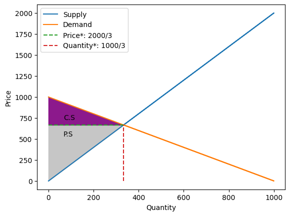
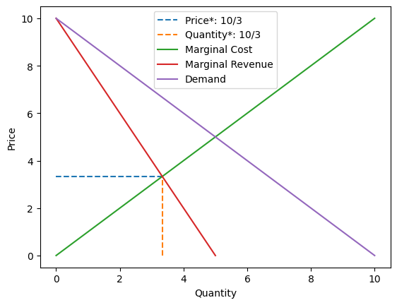

# auto_economics

<!-- WARNING: THIS FILE WAS AUTOGENERATED! DO NOT EDIT! -->

This file will become your README and also the index of your
documentation.

## Install

``` sh
pip install auto_economics
```

Link: https://pypi.org/project/auto-economics/

## How to use

``` python
from auto_economics.core import Free_market, Monopoly
```

``` python
supply_function = " x"
demand_function = "10 -  x"
market = Free_market(supply=supply_function, demand=demand_function)
```

``` python
consumer_surplus = market.get_consumer_surplus()
print("Consumer Surplus:", round(consumer_surplus))

producer_surplus = market.get_producer_surplus()
print("Producer Surplus:", round(producer_surplus))

economic_surplus = market.get_economic_surplus()

print("Economic Surplus:", round(economic_surplus))
```

    Consumer Surplus: 12
    Producer Surplus: 12
    Economic Surplus: 25

``` python
market.get_graph(complete=True)
```

    cannot multiply variables with zero



``` python
price = market.get_price()
quantity = market.get_quantity()
print(f"Price: {round(price)}, Quantity: {round(quantity)}")
```

    Price: 5, Quantity: 5

``` python
supply = "x"
demand = "10 - x"
market = Monopoly(supply, demand)

market.get_graph(complete=True)
round(market.get_economic_surplus())
```



$\displaystyle 22$
