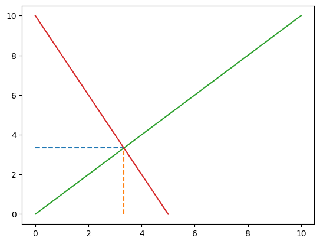

# auto_economics

<!-- WARNING: THIS FILE WAS AUTOGENERATED! DO NOT EDIT! -->

Automate the tedious parts of intro microeconomics: solve for
equilibrium, compute consumer/producer surplus, chart supply and demand,
and see deadweight loss for a monopoly — all from a supply and demand
expression written as plain strings.

## Install

``` sh
pip install auto_economics
```

Link: https://pypi.org/project/auto-economics/

## How to use

### Free market: equilibrium, surplus, and a supply-and-demand chart

``` python
free_market = Free_market(supply="x", demand="10 - x")

print(free_market.equilibrium())
print(f"consumer surplus = {free_market.get_consumer_surplus():.2f}")
print(f"producer surplus = {free_market.get_producer_surplus():.2f}")
print(f"deadweight loss = {free_market.deadweight_loss():.2f}")

free_market.plot(complete=True);
```

    {'quantity': 5.0, 'price': 5.0}
    consumer surplus = 12.50
    producer surplus = 12.50
    deadweight loss = 0.00



### Monopoly: quantity/price distortion and deadweight loss

Pass the same marginal-cost curve as `supply` to see how a monopolist
restricts output relative to the competitive outcome, and the deadweight
loss that results.

``` python
monopoly = Monopoly(supply="x", demand="10 - x")

print(f"monopoly equilibrium = {monopoly.equilibrium()}")
print(f"competitive equilibrium = {monopoly.competitive_equilibrium()}")
print(f"deadweight loss = {monopoly.deadweight_loss():.2f}")

monopoly.plot(complete=True);
```

    monopoly equilibrium = {'quantity': 3.3333333333333335, 'price': 6.666666666666666}
    competitive equilibrium = {'quantity': 5.0, 'price': 5.0}
    deadweight loss = 2.78


### Comparing surplus across market structures

``` python
print(f"Consumer surplus free market: {free_market.get_consumer_surplus():.2f}")
print(f"Consumer surplus monopoly:    {monopoly.get_consumer_surplus():.2f}")

print(f"Producer surplus free market: {free_market.get_producer_surplus():.2f}")
print(f"Producer surplus monopoly:    {monopoly.get_producer_surplus():.2f}")

print(f"Economic surplus free market: {free_market.get_economic_surplus():.2f}")
print(f"Economic surplus monopoly:    {monopoly.get_economic_surplus():.2f}")
```

    Consumer surplus free market: 12.50
    Consumer surplus monopoly:    5.56
    Producer surplus free market: 12.50
    Producer surplus monopoly:    16.67
    Economic surplus free market: 25.00
    Economic surplus monopoly:    22.22

### Game theory: find pure-strategy Nash equilibria

``` python
player_1 = {
    "cooperate-cooporate": 3,
    "cooperate-defect": 0,
    "defect-cooporate": 5,
    "defect-defect": -1,
}
player_2 = {
    "cooperate-cooporate": 3,
    "cooperate-defect": 5,
    "defect-cooporate": 0,
    "defect-defect": -1,
}

game = Game(player_1, player_2)
print(f"nash equilibria = {game.find_nash_equilibriums()}")
game.get_game_matrix()
```

    nash equilibria = [('Cooperate', 'Defect'), ('Defect', 'Cooperate')]

<div>
<style scoped>
    .dataframe tbody tr th:only-of-type {
        vertical-align: middle;
    }
&#10;    .dataframe tbody tr th {
        vertical-align: top;
    }
&#10;    .dataframe thead th {
        text-align: right;
    }
</style>

|           | Cooperate | Defect |
|-----------|-----------|--------|
| Cooperate | 3, 3      | 0, 5   |
| Defect    | 5, 0      | -1, -1 |

</div>

Or as a copy-pasteable image, with the Nash equilibria highlighted:

``` python
game.plot_matrix();
```


## Exporting figures for assignments

Every `plot`/`plot_matrix`/`get_graph` call accepts `save_path` and
`dpi`, so you can write a crisp PNG or SVG straight to disk instead of
copying a screenshot:

``` python
free_market.plot(complete=True, show=False, save_path="free_market.svg")
monopoly.plot(complete=True, show=False, save_path="monopoly.png", dpi=300)
game.plot_matrix(show=False, save_path="payoff_matrix.png")
```

## Supply and demand expressions

`supply` and `demand` accept any expression in the quantity variable `x`
— a linear string like `"10 - x"`, a `sympy` expression, or a plain
number for a constant curve.
