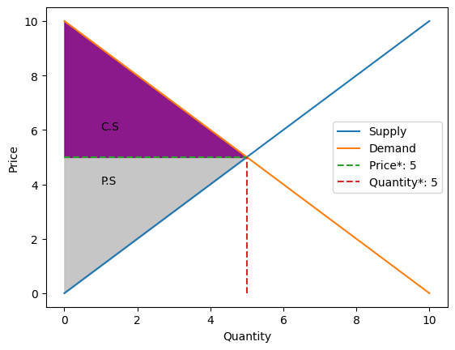
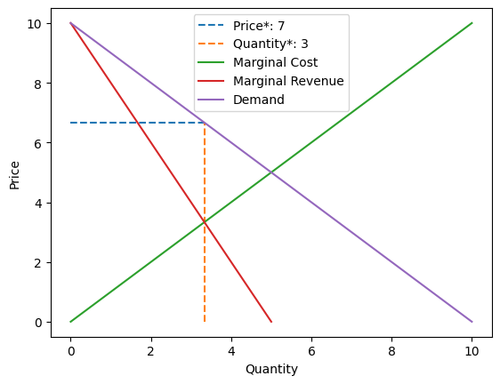

# auto_economics

<!-- WARNING: THIS FILE WAS AUTOGENERATED! DO NOT EDIT! -->

This file will become your README and also the index of your
documentation.

## Install

``` sh
pip install auto_economics
```

Link: https://pypi.org/project/auto-economics/

## How to use

Fill me in please! Don’t forget code examples:

``` python
from auto_economics.core import Free_market, Monopoly
```

``` python
supply_function = " 2*x"
demand_function = "1000 -  x"
market = Free_market(supply=supply_function, demand=demand_function)
```

``` python
consumer_surplus = market.get_consumer_surplus()
print("Consumer Surplus:", round(consumer_surplus))

producer_surplus = market.get_producer_surplus()
print("Producer Surplus:", round(producer_surplus))

economic_surplus = market.get_economic_surplus()

print("Economic Surplus:", round(economic_surplus))
```

    Consumer Surplus: 55556
    Producer Surplus: 111111
    Economic Surplus: 166667

``` python
market.get_graph(complete=True)
```

    cannot multiply variables with zero



``` python
price = market.get_price()
quantity = market.get_quantity()
print(f"Price: {price}, Quantity: {quantity}")
```

    Price: 2000/3, Quantity: 1000/3

``` python
supply = "x"
demand = "10 - x"
market = Monopoly(supply, demand)

market.get_graph(complete=True, is_tot_cost = True)
```


